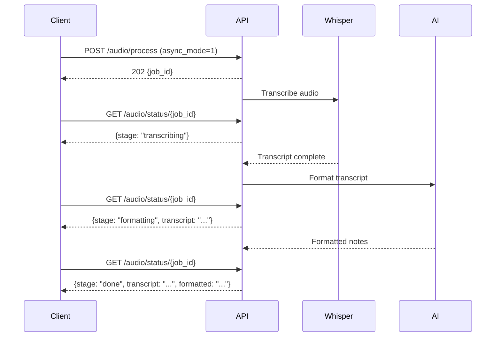

The Audio API provides asynchronous audio processing: upload an audio file, transcribe it using Whisper, and format the transcript as structured meeting notes or conversation summaries.

---

## Process Audio

<RequestExample>
```bash cURL (Synchronous)
curl -X POST "http://localhost:8000/api/audio/process" \
  -H "Authorization: Bearer YOUR_TOKEN" \
  -F "file=@meeting.mp3" \
  -F "instruction=Format as meeting notes with action items" \
  -F "whisper_model=base" \
  -F "async_mode=0"
```

```bash cURL (Async)
curl -X POST "http://localhost:8000/api/audio/process" \
  -H "Authorization: Bearer YOUR_TOKEN" \
  -F "file=@meeting.mp3" \
  -F "instruction=Format as meeting notes with action items" \
  -F "whisper_model=base" \
  -F "async_mode=1"
```
</RequestExample>

<ResponseExample>
```json Synchronous
{
  "transcript": "Welcome to today's meeting. We discussed the Q1 roadmap...",
  "formatted": "# Meeting Notes\n\n## Summary\nDiscussed Q1 roadmap and priorities.\n\n## Action Items\n- [ ] John to review design specs\n- [ ] Sarah to schedule follow-up"
}
```

```json Async (202)
{
  "job_id": "a1b2c3d4-e5f6-7890-abcd-ef1234567890"
}
```
</ResponseExample>

### Endpoint

```
POST /api/audio/process
```

Upload and process an audio file. Supports both synchronous (blocking) and asynchronous (polling) modes.

### Form Parameters (multipart/form-data)

<ParamField body="file" type="file" required>
  Audio file to transcribe (supports common formats: mp3, m4a, wav, etc.)
</ParamField>

<ParamField body="instruction" type="string" default="">
  Formatting instruction for the AI (e.g., "Format as meeting notes with action items", "Summarize the conversation")
</ParamField>

<ParamField body="whisper_model" type="string" default="base">
  Whisper model to use for transcription (`tiny`, `base`, `small`, `medium`, `large`)
</ParamField>

<ParamField body="async_mode" type="string" default="0">
  - `0` = Synchronous (wait for completion)
  - `1` = Asynchronous (returns `job_id` immediately with HTTP 202)
</ParamField>

### Response (Synchronous)

<ResponseField name="transcript" type="string">
  Raw transcription of the audio
</ResponseField>

<ResponseField name="formatted" type="string">
  AI-formatted output (meeting notes, summary, etc.)
</ResponseField>

### Response (Async)

<ResponseField name="job_id" type="string">
  Unique job identifier for polling status
</ResponseField>

When `async_mode=1`, the endpoint returns `202 Accepted` with a `job_id`. Poll `GET /api/audio/status/{job_id}` for progress.

---

## Get Job Status

<RequestExample>
```bash cURL
curl -X GET "http://localhost:8000/api/audio/status/a1b2c3d4-e5f6-7890-abcd-ef1234567890"
```
</RequestExample>

<ResponseExample>
```json In Progress
{
  "stage": "transcribing"
}
```

```json Formatting
{
  "stage": "formatting",
  "transcript": "Welcome to today's meeting..."
}
```

```json Complete
{
  "stage": "done",
  "transcript": "Welcome to today's meeting. We discussed the Q1 roadmap...",
  "formatted": "# Meeting Notes\n\n## Summary\nDiscussed Q1 roadmap and priorities.\n\n## Action Items\n- [ ] John to review design specs\n- [ ] Sarah to schedule follow-up"
}
```

```json Error
{
  "stage": "error",
  "error": "Whisper transcription failed: Invalid audio format"
}
```
</ResponseExample>

### Endpoint

```
GET /api/audio/status/{job_id}
```

Poll for async audio job progress.

### Path Parameters

<ParamField path="job_id" type="string" required>
  Job ID returned from `POST /api/audio/process` with `async_mode=1`
</ParamField>

### Response

<ResponseField name="stage" type="string">
  Current processing stage:
  - `transcribing` — Running Whisper transcription
  - `formatting` — AI is formatting the transcript
  - `done` — Processing complete
  - `error` — Job failed
</ResponseField>

<ResponseField name="transcript" type="string">
  Raw transcript (available after transcription completes)
</ResponseField>

<ResponseField name="formatted" type="string">
  Formatted output (available when `stage=done`)
</ResponseField>

<ResponseField name="error" type="string">
  Error message (present when `stage=error`)
</ResponseField>

### Job Expiration

Jobs expire after 1 hour. Polling an expired job returns `404`.

---

## Async Processing Flow

1. **Upload** — `POST /api/audio/process` with `async_mode=1`
2. **Receive Job ID** — Get `202 Accepted` with `job_id`
3. **Poll Status** — `GET /api/audio/status/{job_id}` until `stage=done`
4. **Retrieve Results** — Access `transcript` and `formatted` fields



---

## Model Selection

Whisper models trade accuracy for speed:

| Model | Speed | Accuracy | Use Case |
|-------|-------|----------|----------|
| `tiny` | Fastest | Lowest | Quick drafts |
| `base` | Fast | Good | Default choice |
| `small` | Medium | Better | Important meetings |
| `medium` | Slow | High | Technical content |
| `large` | Slowest | Highest | Critical transcription |
