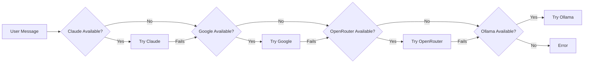

Asta supports multiple AI providers with automatic fallback. This page explains how to configure each provider, their unique features, and how the fallback chain works.

## Supported Providers

<CardGroup cols={3}>
  <Card title="Claude" icon="anthropic">
    **Anthropic Claude**
    - Models: Claude 3.5 Sonnet, Claude 4.0
    - Native vision and PDF support
    - Extended thinking mode
    - Tool calling support
  </Card>

  <Card title="Google Gemini" icon="google">
    **Google AI**
    - Models: Gemini 2.0, Gemini 1.5 Pro/Flash
    - Native vision support
    - Fast response times
    - Free tier available
  </Card>

  <Card title="OpenRouter" icon="route">
    **OpenRouter**
    - Access to 100+ models
    - Kimi k2.5 with reasoning
    - Trinity models
    - Pay-per-token pricing
  </Card>

  <Card title="Ollama" icon="server">
    **Local Ollama**
    - Run models locally
    - No API key required
    - Privacy-focused
    - Works offline
  </Card>

  <Card title="OpenAI" icon="openai">
    **OpenAI GPT**
    - GPT-4, GPT-4 Turbo
    - Vision and tool support
    - Production-grade reliability
  </Card>

  <Card title="Groq" icon="bolt">
    **Groq**
    - Ultra-fast inference
    - Llama 3, Mixtral models
    - Tool calling support
  </Card>
</CardGroup>

## Provider Configuration

### Setting Up API Keys

You can configure provider API keys in two ways:

<Tabs>
  <Tab title="Settings UI">
    **Desktop App:**
    1. Open Settings (gear icon or `Cmd/Ctrl+,`)
    2. Go to **Keys** tab
    3. Enter your API key for each provider
    4. Click **Save**

    **Supported Keys:**
    - Anthropic API Key (Claude)
    - Google AI API Key (Gemini)
    - OpenRouter API Key
    - OpenAI API Key
    - Groq API Key

    <Note>
    Ollama doesn't require an API key - it connects to `localhost:11434` by default.
    </Note>
  </Tab>

  <Tab title="Environment Variables">
    Create or edit `backend/.env`:

    ```bash
    # Claude
    ANTHROPIC_API_KEY=sk-ant-...

    # Google Gemini
    GEMINI_API_KEY=AIza...

    # OpenRouter
    OPENROUTER_API_KEY=sk-or-v1-...

    # OpenAI
    OPENAI_API_KEY=sk-proj-...

    # Groq
    GROQ_API_KEY=gsk_...

    # Ollama (optional, defaults to localhost:11434)
    OLLAMA_BASE_URL=http://localhost:11434
    ```

    Restart Asta after editing `.env`:
    ```bash
    ./asta.sh restart
    ```
  </Tab>
</Tabs>

### Choosing Your Default Provider

<Steps>
  <Step title="Open Settings">
    Navigate to **Settings** → **General** tab
  </Step>

  <Step title="Select Default Provider">
    Choose from the dropdown:
    - Claude (recommended for best results)
    - Google (fast and free)
    - OpenRouter (most model choices)
    - Ollama (local and private)
  </Step>

  <Step title="Select Model">
    Choose the specific model for that provider in **Settings** → **Models** tab
  </Step>
</Steps>

<Tip>
Asta will automatically fall back to other providers if your default fails, so you don't need to worry about API limits or outages.
</Tip>

## Provider Fallback Chain

Asta uses a **fixed fallback order** inspired by OpenClaw:



### How Fallback Works

**Provider Runtime State** (`backend/app/provider_flow.py`):

1. **Manual Disable**: You can disable providers in Settings
2. **Auto-Disable**: Asta automatically disables providers on:
   - Authentication failures (invalid API key)
   - Billing failures (quota exceeded, payment required)
   - Rate limit errors (temporarily)
3. **Re-enable**: Auto-disabled providers can be re-enabled in Settings once the issue is resolved

**Fallback Criteria** (`backend/app/providers/fallback.py`):

<Accordion title="Provider Selection Logic">
  For a provider to be used:
  - Must have valid API key (except Ollama)
  - Must be enabled (not manually disabled)
  - Must not be auto-disabled
  - Must not be excluded from current request

  ```python
  # From backend/app/providers/fallback.py
  async def get_available_fallback_providers(
      db,
      user_id: str,
      exclude_provider: str,
  ) -> list[str]:
      """Return fixed-order fallback providers that are configured and active."""
      ordered = resolve_main_provider_order(exclude_provider)
      states = await db.get_provider_runtime_states(user_id, ordered)
      available: list[str] = []
      for provider_name in ordered:
          if provider_name == exclude_provider:
              continue
          state = states.get(provider_name) or {}
          if not bool(state.get("enabled", True)):
              continue
          if bool(state.get("auto_disabled", False)):
              continue
          if await _provider_has_key(db, provider_name):
              available.append(provider_name)
      return available
  ```
</Accordion>

## Provider-Specific Features

### Claude (Anthropic)

<Card title="Claude" icon="anthropic">
  **File:** `backend/app/providers/claude.py`
  
  **Unique Features:**
  - Extended thinking mode with `<thinking>` blocks
  - Native PDF document reading (full-fidelity)
  - Supports reasoning effort levels
  - Best for complex reasoning tasks

  **Configuration:**
  ```python
  # Environment variable
  ANTHROPIC_API_KEY=sk-ant-...
  
  # Default model
  claude-3-5-sonnet-20241022
  
  # Thinking levels supported
  thinking_level: off | minimal | low | medium | high | xhigh
  ```

  **When to use:**
  - Complex multi-step reasoning
  - Document analysis (PDFs)
  - Creative writing
  - Code generation with detailed explanations
</Card>

### Google Gemini

<Card title="Google Gemini" icon="google">
  **File:** `backend/app/providers/google.py`
  
  **Unique Features:**
  - Free tier with generous limits
  - Fast response times
  - Native vision support
  - Tool calling support

  **Configuration:**
  ```python
  # Environment variable
  GEMINI_API_KEY=AIza...
  
  # Default models
  gemini-2.0-flash-exp
  gemini-1.5-pro-latest
  
  # Free tier limits
  - 15 requests per minute
  - 1 million tokens per minute
  ```

  **When to use:**
  - Everyday chat interactions
  - Quick questions and answers
  - When you need fast responses
  - Image analysis
</Card>

### OpenRouter

<Card title="OpenRouter" icon="route">
  **File:** `backend/app/providers/openrouter.py`
  
  **Unique Features:**
  - Access to 100+ models from different providers
  - Kimi k2.5 with native reasoning (`moonshotai/kimi-k2.5`)
  - Trinity models with reasoning support
  - Vision preprocessor fallback for non-vision models
  - Reasoning effort and streaming

  **Configuration:**
  ```python
  # Environment variable
  OPENROUTER_API_KEY=sk-or-v1-...
  
  # Recommended models
  moonshotai/kimi-k2.5              # Reasoning model
  anthropic/claude-3.5-sonnet       # Claude via OpenRouter
  google/gemini-2.0-flash-exp:free  # Free Gemini
  
  # Reasoning configuration
  reasoning_effort: low | medium | high
  include_reasoning: true
  ```

  **Reasoning Support:**
  OpenRouter injects `<think>...</think>` tags around reasoning content, which Asta's stream state machine parses for UI display.

  **When to use:**
  - Comparing multiple models
  - Accessing models not available elsewhere
  - Using reasoning models like Kimi k2.5
  - Vision preprocessing for non-vision providers
</Card>

### Ollama (Local)

<Card title="Ollama" icon="server">
  **File:** `backend/app/providers/ollama.py`
  
  **Unique Features:**
  - Runs models locally on your machine
  - No API key required
  - Complete privacy (no data sent to cloud)
  - Works offline
  - Free to use

  **Configuration:**
  ```bash
  # Install Ollama first
  # macOS: brew install ollama
  # Linux: curl -fsSL https://ollama.ai/install.sh | sh
  
  # Pull models
  ollama pull llama3.2
  ollama pull qwen2.5-coder
  ollama pull mistral
  
  # Optional: custom base URL
  OLLAMA_BASE_URL=http://localhost:11434
  ```

  **Model Capabilities:**
  Asta detects tool-capable Ollama models automatically. Recommended tool-capable models:
  - `llama3.2` (3B, 1B)
  - `mistral` (7B)
  - `qwen2.5-coder` (7B)

  **When to use:**
  - Privacy-sensitive tasks
  - Offline work
  - Learning and experimentation
  - Avoiding API costs
</Card>

### OpenAI

<Card title="OpenAI" icon="openai">
  **File:** `backend/app/providers/openai.py`
  
  **Unique Features:**
  - Production-grade reliability
  - Vision support
  - Tool calling
  - Streaming responses

  **Configuration:**
  ```python
  # Environment variable
  OPENAI_API_KEY=sk-proj-...
  
  # Recommended models
  gpt-4-turbo
  gpt-4
  gpt-3.5-turbo
  ```

  **When to use:**
  - Production applications requiring stability
  - When you have OpenAI credits
  - Tool-heavy workflows
</Card>

### Groq

<Card title="Groq" icon="bolt">
  **File:** `backend/app/providers/groq.py`
  
  **Unique Features:**
  - Ultra-fast inference (500+ tokens/sec)
  - Open-source models (Llama, Mixtral)
  - Tool calling support
  - Generous free tier

  **Configuration:**
  ```python
  # Environment variable
  GROQ_API_KEY=gsk_...
  
  # Available models
  llama-3.3-70b-versatile
  llama-3.1-70b-versatile
  mixtral-8x7b-32768
  ```

  **When to use:**
  - When speed is critical
  - Rapid prototyping and testing
  - Batch processing of many requests
</Card>

## Vision Pipeline

Asta has a **hybrid vision pipeline** (`backend/app/handler.py:_run_vision_preprocessor`):

<Steps>
  <Step title="Native Vision Providers">
    **Claude, Google, OpenAI** receive images and PDFs directly:
    - Images as base64-encoded content
    - PDFs as native `document` blocks (Claude) or extracted text
    - No preprocessing required
  </Step>

  <Step title="Vision Preprocessor Fallback">
    **Ollama, Groq** (non-vision providers) use OpenRouter vision models:
    
    Fallback chain:
    1. `google/gemma-3-27b-it:free`
    2. `nvidia/nemotron-nano-12b-v2-vl:free`
    3. `google/gemma-3-12b-it:free`
    4. `openrouter/auto`
    
    The vision analysis is injected as `[VISION_ANALYSIS ...]` into the user message.
  </Step>

  <Step title="Final Reasoning">
    Main provider (even if non-vision) receives the preprocessed vision analysis and performs reasoning/tool execution.
  </Step>
</Steps>

## Reasoning and Thinking Modes

Asta supports advanced reasoning modes with provider-specific implementations:

<Tabs>
  <Tab title="Thinking Levels">
    Configure in **Settings** → **General** → **Thinking Level**:

    - `off` - No thinking blocks
    - `minimal` - Brief internal thoughts
    - `low` - Short reasoning
    - `medium` - Moderate reasoning
    - `high` - Detailed reasoning
    - `xhigh` - Extended thinking (Claude only)

    **Supported by:** Claude, OpenRouter (Kimi/Trinity)
  </Tab>

  <Tab title="Reasoning Mode">
    Configure in **Settings** → **General** → **Reasoning Mode**:

    - `off` - No reasoning display
    - `on` - Show reasoning after completion
    - `stream` - Stream reasoning in real-time

    **How it works:**
    - Reasoning content appears in `<think>...</think>` tags
    - Stream state machine (`backend/app/stream_state_machine.py`) parses reasoning
    - UI displays reasoning separately from main response

    **Supported by:** OpenRouter (Kimi, Trinity)
  </Tab>

  <Tab title="Telegram Commands">
    Control thinking/reasoning via Telegram:

    ```bash
    # Set thinking level
    /think medium
    /t high  # alias

    # Set reasoning mode
    /reasoning stream
    /reasoning off

    # Check current settings
    /think
    /reasoning
    ```
  </Tab>
</Tabs>

## Troubleshooting

<AccordionGroup>
  <Accordion title="Provider keeps getting auto-disabled">
    **Causes:**
    - Invalid API key → Check key in Settings
    - Quota exceeded → Add credits or wait for reset
    - Billing issue → Verify payment method

    **Solution:**
    1. Fix the underlying issue (add credits, update key)
    2. Go to **Settings** → **Models**
    3. Find the provider in runtime state
    4. Click **Re-enable**
  </Accordion>

  <Accordion title="Ollama not working">
    **Checklist:**
    - [ ] Ollama is installed: `ollama --version`
    - [ ] Ollama service is running: `ollama list`
    - [ ] Models are pulled: `ollama pull llama3.2`
    - [ ] Correct base URL: Check `OLLAMA_BASE_URL` in Settings

    **Common fix:**
    ```bash
    # Start Ollama service
    ollama serve

    # In another terminal, pull a model
    ollama pull llama3.2
    ```
  </Accordion>

  <Accordion title="Vision not working">
    **For native vision providers (Claude, Google, OpenAI):**
    - Ensure the model supports vision (e.g., `claude-3-5-sonnet`, `gemini-2.0-flash`)
    - Check image format is supported (JPEG, PNG, WebP)
    - Verify image size is within limits (< 5MB)

    **For non-vision providers (Ollama, Groq):**
    - Ensure OpenRouter API key is configured (used for vision preprocessing)
    - Check OpenRouter has credits
  </Accordion>

  <Accordion title="All providers failing">
    **Check:**
    1. Internet connectivity
    2. API keys are valid (test in provider's dashboard)
    3. No firewall blocking requests
    4. Check backend logs: `tail -f backend/backend.log`

    **Emergency fallback:**
    Set up Ollama for offline access:
    ```bash
    ollama pull llama3.2
    # Asta will automatically use Ollama as last resort
    ```
  </Accordion>
</AccordionGroup>

## Best Practices

<CardGroup cols={2}>
  <Card title="Cost Optimization" icon="dollar-sign">
    - Use Google Gemini for everyday tasks (free tier)
    - Reserve Claude for complex reasoning
    - Use Ollama for privacy and cost-free experimentation
    - Monitor usage in provider dashboards
  </Card>

  <Card title="Performance" icon="gauge-high">
    - Use Groq for speed-critical tasks
    - Enable streaming for better UX
    - Choose smaller models for simple tasks
    - Use Ollama for low-latency local inference
  </Card>

  <Card title="Reliability" icon="shield-check">
    - Configure at least 2 providers with valid keys
    - Keep fallback chain enabled
    - Monitor runtime state in Settings
    - Set up Ollama as ultimate fallback
  </Card>

  <Card title="Privacy" icon="user-lock">
    - Use Ollama for sensitive data
    - Be aware of provider data policies
    - Check provider terms for commercial use
    - Consider on-premise deployments for compliance
  </Card>
</CardGroup>

## Next Steps

<CardGroup cols={2}>
  <Card title="Architecture" href="/concepts/architecture" icon="sitemap">
    Understand how providers fit into Asta's architecture
  </Card>
  <Card title="Skills System" href="/concepts/skills-system" icon="puzzle-piece">
    Learn how skills leverage different provider capabilities
  </Card>
  <Card title="Quickstart" href="/quickstart" icon="rocket">
    Get started with configuring your first provider
  </Card>
  <Card title="API Reference" href="/api/chat" icon="code">
    See how to use providers via the API
  </Card>
</CardGroup>