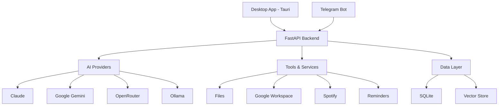

Asta is built as a **personal control plane** with a FastAPI backend and cross-platform Tauri desktop app. This page explains the core architecture, message flow, and component breakdown.

## High-Level Architecture

<Card title="Architecture Overview" icon="layer-group">
Asta follows a client-server architecture with multiple channels (desktop app, Telegram) connecting to a unified backend that orchestrates AI providers, tools, and services.
</Card>



## Component Breakdown

<CardGroup cols={2}>
  <Card title="FastAPI Backend" icon="server">
    Python 3.12/3.13 backend handling:
    - REST API + WebSocket endpoints
    - JWT-based authentication
    - Message routing and context building
    - Tool execution and skill orchestration
    
    **Location:** `backend/app/`
  </Card>

  <Card title="Desktop App" icon="desktop">
    Tauri v2 (Rust + React/TypeScript) providing:
    - Cross-platform UI (macOS/Windows)
    - Dashboard, Chat, Files, Settings
    - Real-time streaming responses
    - Local system integration
    
    **Location:** `MACWinApp/asta-app/`
  </Card>

  <Card title="AI Provider Layer" icon="brain">
    Unified interface to multiple AI providers:
    - Groq, Google Gemini, Claude, OpenAI
    - OpenRouter, Ollama (local)
    - Automatic fallback chain
    - Vision and reasoning support
    
    **Location:** `backend/app/providers/`
  </Card>

  <Card title="Skills System" icon="puzzle-piece">
    Two-tier skill system:
    - Built-in Python skills (time, weather, Spotify)
    - Workspace SKILL.md files (on-demand loading)
    - Host OS gating for platform-specific skills
    
    **Location:** `backend/app/skills/`, `workspace/skills/`
  </Card>

  <Card title="Telegram Channel" icon="telegram">
    Bot integration for mobile access:
    - Long polling for updates
    - Same message handler as desktop
    - Inline buttons for approvals
    - Media rendering support
    
    **Location:** `backend/app/channels/telegram_bot.py`
  </Card>

  <Card title="Data Layer" icon="database">
    Persistent storage:
    - SQLite for users, conversations, settings
    - Chroma vector store for RAG
    - Workspace files (markdown notes)
    - Per-user memory files
    
    **Location:** `backend/app/db.py`, `backend/app/rag/`
  </Card>
</CardGroup>

## Message Flow

### Request Path

When a user sends a message through any channel (desktop app or Telegram), here's the complete flow:

<Steps>
  <Step title="Authentication">
    The request passes through `AuthMiddleware` (`backend/app/auth_middleware.py`):
    - JWT validation in multi-user mode
    - Legacy Bearer token in single-user mode
    - Sets `request.state.user_id` and `user_role`
  </Step>

  <Step title="Context Building">
    `build_context()` in `backend/app/context.py` assembles:
    - Recent conversation history
    - Connected channels and ground-truth state
    - Workspace context (USER.md, SOUL.md, TOOLS.md)
    - Available skills list (workspace SKILL.md files)
    - Tool instructions (exec, files, reminders, cron)
    - Service context (time, weather, Spotify, RAG snippets)
  </Step>

  <Step title="Provider Selection">
    `handler.py` determines which AI provider to use:
    - User's default provider setting
    - Provider runtime state (enabled/auto-disabled)
    - Available API keys
    - Fallback chain: Claude → Google → OpenRouter → Ollama
  </Step>

  <Step title="Tool Execution Loop">
    If the AI response includes tool calls:
    - Handler executes each tool (exec, files, reminders, read)
    - Appends tool results to message history
    - Re-calls the same provider for final response
    - Continues until no more tool calls
  </Step>

  <Step title="Response Delivery">
    Final response is:
    - Streamed to desktop app via SSE (Server-Sent Events)
    - Sent to Telegram as formatted message
    - Persisted to conversation history in SQLite
    - Includes reasoning blocks if thinking is enabled
  </Step>
</Steps>

### Vision Flow

For messages with images or PDFs:

1. **Native Vision Providers** (Claude, Google, OpenAI): Receive images/PDFs directly as part of the message
2. **Non-Vision Providers** (Ollama, Groq): Use OpenRouter vision preprocessor fallback chain:
   - `google/gemma-3-27b-it:free` → `nvidia/nemotron-nano-12b-v2-vl:free` → `google/gemma-3-12b-it:free` → `openrouter/auto`
3. **PDF Handling**: Claude receives raw PDFs as native `document` content blocks for full-fidelity reading

## Key Backend Files

<AccordionGroup>
  <Accordion title="backend/app/main.py">
    FastAPI application entry point:
    - Lifespan context manager (startup/shutdown)
    - CORS and authentication middleware
    - Router registration
    - Database initialization
    - Telegram bot startup
  </Accordion>

  <Accordion title="backend/app/handler.py">
    Core message handler:
    - Context building orchestration
    - Provider selection and fallback
    - Tool call execution loop
    - Stream state machine
    - Thinking/reasoning extraction
  </Accordion>

  <Accordion title="backend/app/context.py">
    Context assembly:
    - Workspace context injection
    - Recent conversation history
    - Ground-truth state (location, reminders count)
    - Available skills prompt
    - Service-specific context sections
  </Accordion>

  <Accordion title="backend/app/providers/fallback.py">
    Provider fallback logic:
    - Fixed chain order resolution
    - Runtime state checking
    - API key validation
    - Auto-disable on billing/auth failures
    - Stream event lifecycle management
  </Accordion>

  <Accordion title="backend/app/auth_middleware.py">
    Authentication middleware:
    - Multi-user JWT validation
    - Single-user Bearer token fallback
    - Public path exemptions
    - User context injection
  </Accordion>
</AccordionGroup>

## Desktop App Structure

<Card title="Tauri Application" icon="window">
The desktop app is built with Tauri v2, combining Rust for native system access with React/TypeScript for the UI.
</Card>

### Frontend (React/TypeScript)

```
MACWinApp/asta-app/src/
├── App.tsx                  # Main app component
├── components/
│   ├── Chat/                # Chat view and message components
│   ├── Settings/            # Settings sheet with tabs
│   ├── Agents/              # Agent management
│   ├── Login/               # Authentication pages
│   └── Dashboard/           # Dashboard widgets
└── utils/                   # API client and helpers
```

**Key Dependencies** (from `package.json`):
- `@tauri-apps/api` - Tauri JavaScript bindings
- `react-markdown` - Markdown rendering for messages
- `react-syntax-highlighter` - Code block syntax highlighting

### Backend (Rust)

```
MACWinApp/asta-app/src-tauri/
├── src/
│   ├── main.rs              # Tauri commands and window setup
│   └── lib.rs               # Additional native functionality
├── Cargo.toml               # Rust dependencies
└── tauri.conf.json          # Tauri configuration
```

**Features:**
- Global shortcut (`Alt+Space`) to show/hide window
- Auto-start on system boot
- Window management and system tray
- HTTP client for backend communication

## Data Model

<Tabs>
  <Tab title="Users & Auth">
    **users** table:
    - `id` (UUID)
    - `username` (unique)
    - `password_hash` (bcrypt)
    - `role` (admin | user)
    - `created_at`

    **JWT tokens** with 30-day expiry containing:
    - `sub`: user_id
    - `username`
    - `role`
  </Tab>

  <Tab title="Conversations">
    **conversations** table:
    - `id`
    - `user_id`
    - `channel` (web | telegram | subagent)
    - `created_at`

    **messages** table:
    - `id`
    - `conversation_id`
    - `role` (user | assistant)
    - `content`
    - `provider_used`
    - `created_at`
  </Tab>

  <Tab title="Settings">
    **user_settings** table:
    - `user_id`
    - `mood`
    - `default_ai_provider`
    - `thinking_level` (off | minimal | low | medium | high | xhigh)
    - `reasoning_mode` (off | on | stream)

    **provider_models**, **provider_runtime_state**, **skill_toggles**, **api_keys**
  </Tab>

  <Tab title="Tasks & Reminders">
    **cron_jobs** table:
    - Recurring cron expressions
    - One-shot reminders (`@at <ISO-UTC>`)
    - Channel targets (web | telegram)

    **cron_job_runs** table:
    - Execution history with timestamps
    - Success/failure status
  </Tab>
</Tabs>

## Workspace Structure

The workspace directory (`workspace/`) contains user data and configuration:

```
workspace/
├── AGENTS.md                # Workspace instructions
├── SOUL.md                  # Asta's personality/tone
├── USER.md                  # Global user context (single-user)
├── TOOLS.md                 # Custom tool notes
├── users/
│   └── {user_id}/
│       └── USER.md          # Per-user memory (multi-user)
├── skills/
│   ├── notes/
│   │   └── SKILL.md         # Notes skill instructions
│   ├── apple-notes/
│   └── things-mac/
└── notes/                   # User's markdown notes
```

<Note>
Workspace skills are loaded **on-demand** (OpenClaw-style): the AI sees a list of available skills in context, selects one relevant skill, and calls `read(path)` to load that skill's `SKILL.md` instructions only when needed.
</Note>

## Security Considerations

<CardGroup cols={2}>
  <Card title="Authentication" icon="lock">
    - JWT-based auth in multi-user mode
    - Bcrypt password hashing
    - Role-based access control (admin/user)
    - Token expiry and refresh
  </Card>

  <Card title="Exec Tool" icon="terminal">
    - Allowlist-based command execution
    - Per-skill required binaries gating
    - Approval system for sensitive commands
    - Configurable security modes (deny/allow/full)
  </Card>

  <Card title="File Access" icon="folder">
    - Restricted to `ASTA_ALLOWED_PATHS`
    - User must explicitly allow new paths
    - No access outside user's home directory
    - Virtual root for safe knowledge access
  </Card>

  <Card title="API Keys" icon="key">
    - Stored encrypted in database
    - Never exposed in logs or responses
    - Configurable via Settings or .env
    - Per-provider runtime state tracking
  </Card>
</CardGroup>

<Warning>
Never commit API keys to version control. Use environment variables or the Settings UI to configure provider keys.
</Warning>

## Next Steps

<CardGroup cols={2}>
  <Card title="AI Providers" href="/concepts/ai-providers" icon="brain">
    Learn about supported AI providers and the fallback chain
  </Card>
  <Card title="Skills System" href="/concepts/skills-system" icon="puzzle-piece">
    Understand how built-in and workspace skills work
  </Card>
  <Card title="Multi-User Auth" href="/concepts/multi-user-auth" icon="users">
    Deep dive into authentication and access control
  </Card>
  <Card title="API Reference" href="/api/chat" icon="code">
    Explore the REST API endpoints
  </Card>
</CardGroup>