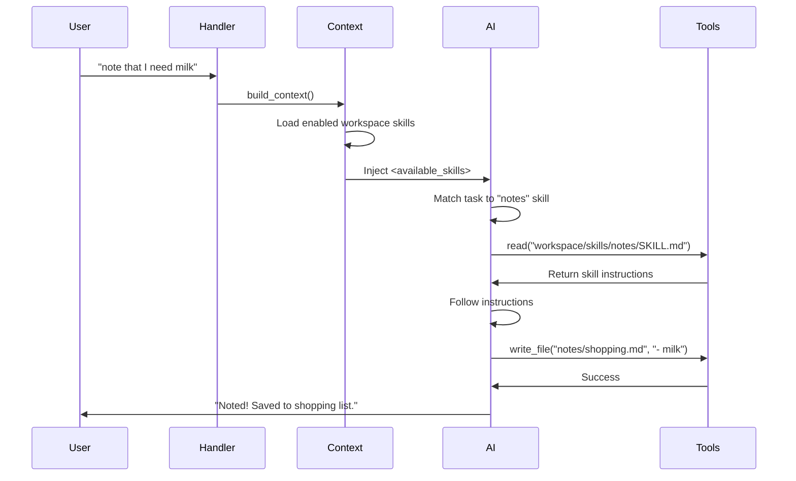

Asta has a powerful two-tier skill system inspired by OpenClaw: **built-in Python skills** for core functionality and **workspace SKILL.md files** for extensible, on-demand capabilities.

## Overview

<CardGroup cols={2}>
  <Card title="Built-in Python Skills" icon="python">
    Core skills implemented in Python:
    - Time, weather, web search
    - Spotify, Google Workspace (Gmail, Calendar, Drive)
    - Files, reminders, learning (RAG)
    - Silly GIFs, server status
    
    **Location:** `backend/app/skills/`
  </Card>

  <Card title="Workspace Skills" icon="file-code">
    User-defined skills as markdown files:
    - Notes, Apple Notes, Things (macOS)
    - Math, GitHub, Vercel, Notion
    - Custom agents and workflows
    - On-demand loading (OpenClaw-style)
    
    **Location:** `workspace/skills/*/SKILL.md`
  </Card>
</CardGroup>

## Skill Loading Strategy

<Note>
Asta uses **OpenClaw-style on-demand skill loading** to minimize context size. Only relevant skills are loaded when needed.
</Note>

### How On-Demand Loading Works

<Steps>
  <Step title="Available Skills List">
    When building context (`backend/app/context.py`), Asta injects an `<available_skills>` block listing all enabled workspace skills with their descriptions:
    
    ```xml
    <available_skills>
      <skill>
        <name>notes</name>
        <description>Save and manage quick notes, meeting notes, or lists...</description>
        <location>workspace/skills/notes/SKILL.md</location>
      </skill>
      <skill>
        <name>apple-notes</name>
        <description>Search and read Apple Notes...</description>
        <location>workspace/skills/apple-notes/SKILL.md</location>
      </skill>
    </available_skills>
    ```
  </Step>

  <Step title="Model Selects Skill">
    The AI model reads the task and selects the most relevant skill from the available list based on the description.
  </Step>

  <Step title="Read Tool Call">
    The model calls `read(path="workspace/skills/notes/SKILL.md")` to load the full skill instructions.
  </Step>

  <Step title="Follow Instructions">
    The model follows the skill's instructions to complete the task, calling tools as specified (e.g., `write_file`, `exec`).
  </Step>
</Steps>

**Benefits:**
- **Token efficiency:** Only load skills actually needed for the current task
- **Scalability:** Add unlimited skills without bloating context
- **Flexibility:** Skills can be detailed without worrying about context limits

## Built-in Python Skills

Built-in skills are intent-based and automatically triggered when relevant.

<Tabs>
  <Tab title="Core Skills">
    ### Time (`backend/app/skills/time.py`)
    
    **When triggered:**
    - "what time is it"
    - "current time"
    - "time in Tokyo"
    
    **What it does:**
    - Gets current time in user's timezone
    - Formats in 12-hour AM/PM format
    - Uses location from `user_location` table or `workspace/USER.md`
    
    **Context injection:**
    ```python
    async def get_context_section(self, db, user_id: str, extra: dict) -> str:
        now = datetime.now()
        return f"[TIME] Current time: {now.strftime('%I:%M %p %Z')}"
    ```

    ---

    ### Weather (`backend/app/skills/weather.py`)
    
    **When triggered:**
    - "what's the weather"
    - "weather tomorrow"
    - "will it rain"
    
    **What it does:**
    - Fetches weather from Open-Meteo API
    - Today and tomorrow forecast
    - Uses geocoded location with normalization
    
    **Example context:**
    ```
    [WEATHER] Chicago, United States
    Today: Partly cloudy, 72°F (22°C)
    Tomorrow: Sunny, 75°F (24°C)
    ```

    ---

    ### Web Search (`backend/app/skills/web.py`)
    
    **When triggered:**
    - "search for"
    - "look up"
    - "what's the latest on"
    
    **What it does:**
    - DuckDuckGo search (no API key required)
    - Returns top results with snippets
    - Prioritizes RAG knowledge first if available
  </Tab>

  <Tab title="Integrations">
    ### Spotify (`backend/app/skills/spotify.py`)
    
    **Features:**
    - Search tracks, albums, artists
    - OAuth playback control
    - Device picker for multi-device setups
    - Fallback to artist search if track not found
    
    **Configuration:**
    Set in **Settings** → **Spotify** or `.env`:
    ```bash
    SPOTIFY_CLIENT_ID=your_client_id
    SPOTIFY_CLIENT_SECRET=your_client_secret
    ```
    
    **Usage:**
    - "play Bohemian Rhapsody on Spotify"
    - "search for Taylor Swift albums"
    - "play on my iPhone"

    ---

    ### Google Workspace (`backend/app/skills/gog.py`)
    
    **Requires:** [`gog` CLI](https://github.com/opencodesolutions/gog) installed and authenticated
    
    **Features:**
    - **Gmail:** Search emails, read threads
    - **Calendar:** List events, create new events
    - **Drive:** Search files, download
    
    **Setup:**
    ```bash
    # Install gog
    brew install gog  # or download from GitHub
    
    # Authenticate
    gog auth add
    ```
    
    **Usage:**
    - "show my emails from yesterday"
    - "what's on my calendar today"
    - "find files in Drive named 'report'"

    ---

    ### Files (`backend/app/skills/files.py`)
    
    **Tools provided:**
    - `list_directory` - List files in a path
    - `read_file` - Read file contents
    - `write_file` - Create or overwrite file
    - `allow_path` - Request access to new directory
    - `delete_file` - Delete single file
    - `delete_matching_files` - Delete by glob pattern
    
    **Security:**
    - Only paths under `ASTA_ALLOWED_PATHS` or user's home
    - Must call `allow_path` for new directories
    - Confirmation required for sensitive operations
  </Tab>

  <Tab title="Utilities">
    ### Reminders (`backend/app/skills/reminders.py`)
    
    **Features:**
    - One-time reminders: "remind me in 30 min"
    - Absolute time: "wake me up at 7am tomorrow"
    - Natural language parsing
    - Voice calls via Pingram (if configured)
    
    **Internals:**
    One-shot reminders are stored as cron entries with `@at <ISO-UTC>` expression.
    
    **Tool actions:**
    - `add` - Create reminder
    - `list` / `status` - View reminders
    - `update` - Modify reminder
    - `remove` - Delete reminder

    ---

    ### RAG / Learning (`backend/app/skills/learning.py`, `rag.py`)
    
    **Features:**
    - Ingest URLs, files, or pasted text
    - Chunk and embed with Ollama (`nomic-embed-text`)
    - Store in Chroma vector database
    - Retrieve relevant snippets for queries
    
    **Usage:**
    - "learn about Next.js for 2 hours"
    - "become an expert on React hooks"
    - "what did I learn about TypeScript?"
    
    **Storage:** `backend/chroma_db/`

    ---

    ### Silly GIF (`backend/app/skills/silly_gif.py`)
    
    **When triggered:**
    - Random chance (~0.2%) for fun responses
    
    **What it does:**
    - Searches Giphy for a relevant GIF
    - Returns markdown image link
    - Adds personality to responses
  </Tab>
</Tabs>

## Workspace Skills (SKILL.md)

Workspace skills are markdown files with YAML frontmatter and instructions.

### Skill File Structure

```markdown
---
name: skill-name
description: Brief description shown in available_skills list
metadata:
  clawdbot:
    emoji: 📝
    os: ["darwin", "linux"]  # Optional: restrict by OS
requires:
  bins: ["memo", "jq"]  # Optional: required binaries
---

# Skill Name

Detailed instructions for the AI model.

## When to use

- Trigger patterns and user intents
- Examples of relevant requests

## How to use

1. Call this tool with these parameters
2. Process the output
3. Format and return the response

## Examples

```
tool_call(param="value")
```
```

### Frontmatter Fields

<ParamField path="name" type="string" required>
  Internal skill identifier (matches folder name)
</ParamField>

<ParamField path="description" type="string" required>
  Brief description shown to the AI when listing available skills. Should clearly indicate when the skill is relevant.
</ParamField>

<ParamField path="metadata.clawdbot.emoji" type="string">
  Emoji icon for the skill (displayed in UI)
</ParamField>

<ParamField path="metadata.clawdbot.os" type="array">
  Allowed operating systems: `["darwin", "linux", "windows"]`
  
  If specified, skill is only available on matching OS.
</ParamField>

<ParamField path="requires.bins" type="array">
  Required executable binaries (e.g., `["memo", "jq"]`)
  
  - Automatically added to exec allowlist when skill is enabled
  - Skill hidden if binaries not found in PATH
</ParamField>

<ParamField path="is_agent" type="boolean">
  Set to `true` for named agent skills (see [Named Agents](#named-agents))
</ParamField>

<ParamField path="model" type="string">
  Default AI model for this skill/agent (e.g., `claude-3-5-sonnet`)
</ParamField>

<ParamField path="thinking" type="string">
  Default thinking level: `off|minimal|low|medium|high|xhigh`
</ParamField>

### Example: Notes Skill

<Accordion title="workspace/skills/notes/SKILL.md">
```markdown
---
name: notes
description: Save and manage quick notes, meeting notes, or lists in the workspace. Use when the user says "note that", "add a note", "save this", "quick note", "write that down", "add to my notes", or "create a note".
metadata: {"clawdbot":{"emoji":"📝","os":["darwin","linux"]}}
---

# Notes

Save notes and lists to `notes/` in the workspace so they persist and can be read later.

## When to use

- User says: "note that", "add a note", "save this", "quick note", "write that down"
- User wants to save a list, a quote, meeting points, or any short text for later

## How to save a note

Call the **`write_file`** tool with:
- `path`: workspace-relative like `notes/shopping-list.md` or `notes/2024-02-13.md`
- `content`: the note content in markdown

**Naming rules:**
- Named note (user gives title): sanitize to lowercase + hyphens → `notes/shopping-list.md`
- Date-based (no title): `notes/note-YYYY-MM-DD.md`
- Meeting notes: `notes/meeting-YYYY-MM-DD.md`

## Examples

**Quick note:**
```
write_file(path="notes/note-2024-02-13.md", content="# Quick note\n- Meeting Tuesday 3pm")
```

**Shopping list:**
```
write_file(path="notes/shopping-list.md", content="# Shopping list\n- Milk\n- Bananas")
```

## Reading notes

If the user asks "what's in my notes" or "read my note about X":
- Use `list_directory` on the workspace `notes/` folder
- Use `read_file` to open a specific note
```
</Accordion>

### Example: Apple Notes Skill (macOS-only)

<Accordion title="workspace/skills/apple-notes/SKILL.md">

**YAML Frontmatter:**
```yaml
---
name: apple-notes
description: Search and read Apple Notes on macOS. Use when user says "check my notes", "what's in my Apple Notes", "memo notes", or asks about notes stored in the Notes app.
metadata:
  clawdbot:
    emoji: 🍎
    os: ["darwin"]  # macOS only
requires:
  bins: ["memo"]  # Requires memo CLI
---
```

**Skill Content:**

Access Apple Notes on macOS using the `memo` CLI.

**When to use:**
- User asks: "check my Apple Notes", "what's in Notes app", "memo notes"
- User mentions looking for a note in Apple Notes

**Installation:**

Requires [memo](https://github.com/neatc0der/memo) CLI:
```bash
brew install neatc0der/tap/memo
```

**Commands:**

List all notes:
```bash
exec(command="memo notes")
```

Search notes:
```bash
exec(command="memo notes -s 'search query'")
```

Read specific note:
```bash
exec(command="memo read <note-id>")
```

**Example flow:**

User: "check my notes for meeting notes"

1. Call: `exec(command="memo notes -s 'meeting'")`
2. Parse the output (list of matching notes)
3. Call: `exec(command="memo read <id>")` for relevant notes
4. Return formatted results

</Accordion>

## Host OS Gating

Skills can be restricted to specific operating systems using the `metadata.clawdbot.os` field.

**Implementation** (`backend/app/workspace.py`):

```python
def _skill_os_allowed(metadata: dict) -> bool:
    """Check if skill is allowed on current OS."""
    import platform
    clawdbot = metadata.get("clawdbot") or {}
    allowed_os = clawdbot.get("os")
    if not allowed_os:
        return True  # No restriction
    current_os = platform.system().lower()
    os_map = {"darwin": "darwin", "linux": "linux", "windows": "windows"}
    return os_map.get(current_os) in allowed_os
```

**Example use cases:**
- `apple-notes` - macOS only (requires Apple Notes app)
- `things-mac` - macOS only (Things app)
- `notion` - All platforms
- `notes` - macOS and Linux only

## Required Binaries

Skills can declare required executables that must be present in PATH.

<Steps>
  <Step title="Declare in Frontmatter">
    ```yaml
    requires:
      bins: ["memo", "jq"]
    ```
  </Step>

  <Step title="Binary Resolution">
    Asta searches for binaries in:
    - Standard PATH
    - `/opt/homebrew/bin` (Homebrew on Apple Silicon)
    - `/usr/local/bin` (Homebrew on Intel)
    - `~/.local/bin` (User binaries)
  </Step>

  <Step title="Auto-Allowlist">
    When the skill is enabled:
    - Required binaries are added to exec allowlist
    - Asta can call them via the exec tool
    - No need to manually configure allowlist
  </Step>

  <Step title="Skill Gating">
    If any required binary is missing:
    - Skill is hidden from `<available_skills>` list
    - Prevents confusing the AI with unavailable skills
    - User sees warning in Settings UI
  </Step>
</Steps>

## Named Agents

Workspace skills can be marked as **agents** - specialized AI behaviors with custom instructions.

<Card title="What are Named Agents?" icon="robot">
  Named agents are workspace skills with `is_agent: true` in frontmatter. They appear in the Agents API and can have custom models and thinking levels.
</Card>

### Creating a Named Agent

<Steps>
  <Step title="Create Skill Folder">
    ```bash
    mkdir -p workspace/skills/research-agent
    ```
  </Step>

  <Step title="Write SKILL.md">
    ```markdown
    ---
    name: Research Agent
    description: Deep research agent that coordinates multiple subagents
    emoji: 🔬
    model: claude-3-5-sonnet
    thinking: high
    is_agent: true
    ---

    # Research Agent

    You are a research agent specializing in comprehensive industry analysis.

    ## Your Process

    1. Break down research request into sub-tasks
    2. Spawn subagents for:
       - Data gathering (researcher)
       - Report writing (report_writer)
       - Fact checking (fact_checker)
    3. Synthesize findings into final report

    ## Guidelines

    - Always cite sources
    - Cross-reference facts
    - Provide balanced perspectives
    ```
  </Step>

  <Step title="Access via API">
    ```bash
    # List agents
    GET /api/agents

    # Use agent in chat
    POST /api/chat
    {
      "message": "Research the AI infrastructure market",
      "agent": "research-agent"
    }
    ```
  </Step>
</Steps>

**Agent-specific features:**
- Custom model selection per agent
- Per-agent thinking levels
- Agents can spawn subagents for multi-step workflows
- API endpoints for agent management (`backend/app/routers/agents.py`)

## Skill Management

### Enabling/Disabling Skills

<Tabs>
  <Tab title="Desktop App">
    1. Open **Settings** (gear icon)
    2. Go to **Skills** tab
    3. Toggle switches for each skill
    4. Built-in skills show with Python icon
    5. Workspace skills show with folder icon
  </Tab>

  <Tab title="API">
    ```bash
    # Get skill toggles
    GET /api/settings/skills

    # Enable skill
    POST /api/settings/skills
    {
      "notes": true,
      "apple-notes": true,
      "weather": true
    }
    ```
  </Tab>

  <Tab title="Database">
    Skills are stored in `skill_toggles` table:
    ```sql
    SELECT * FROM skill_toggles WHERE user_id = 'default';
    ```
    
    - `enabled = 1` - Skill active
    - `enabled = 0` - Skill disabled
    - Not in table - Default (enabled)
  </Tab>
</Tabs>

### Creating Custom Skills

<Steps>
  <Step title="Create Skill Directory">
    ```bash
    mkdir -p workspace/skills/my-skill
    cd workspace/skills/my-skill
    ```
  </Step>

  <Step title="Write SKILL.md">
    ```markdown
    ---
    name: my-skill
    description: Brief description of when to use this skill
    metadata:
      clawdbot:
        emoji: 🎯
    ---

    # My Skill

    Detailed instructions for the AI...

    ## When to use
    - Trigger patterns

    ## How to use
    - Tool calls
    - Expected outputs

    ## Examples
    - Code snippets
    ```
  </Step>

  <Step title="Test the Skill">
    1. Restart Asta or reload skills
    2. Enable in Settings → Skills
    3. Test with relevant query
    4. Check `backend/backend.log` for skill loading
  </Step>

  <Step title="Iterate">
    - Add more examples
    - Refine trigger descriptions
    - Add error handling guidance
    - Document edge cases
  </Step>
</Steps>

## Skill Execution Flow



## Best Practices

<CardGroup cols={2}>
  <Card title="Clear Descriptions" icon="message">
    Write descriptions that clearly indicate when the skill should be used:
    
    ✅ Good: "Use when user says 'note that', 'save this', or 'write that down'"
    
    ❌ Bad: "Handles notes"
  </Card>

  <Card title="Concrete Examples" icon="code">
    Include real tool call examples in SKILL.md:
    
    ```
    write_file(
      path="notes/meeting.md",
      content="# Meeting\n- Item 1"
    )
    ```
  </Card>

  <Card title="Error Guidance" icon="triangle-exclamation">
    Tell the AI how to handle common errors:
    
    "If exec returns 'command not found', tell user to install memo via Homebrew."
  </Card>

  <Card title="Context-Aware" icon="lightbulb">
    Reference available tools and context:
    
    "Use the exec tool with command='memo notes -s query' to search Apple Notes."
  </Card>
</CardGroup>

## Troubleshooting

<AccordionGroup>
  <Accordion title="Skill not appearing in available_skills">
    **Possible causes:**
    - Skill is disabled in Settings → Skills
    - Invalid YAML frontmatter (syntax error)
    - OS restriction (skill requires macOS, running on Linux)
    - Missing required binaries
    - SKILL.md not found in correct location

    **Check:**
    ```bash
    # Verify file exists
    ls -la workspace/skills/my-skill/SKILL.md

    # Check backend logs
    tail -f backend/backend.log | grep skill

    # Test frontmatter parsing
    python -c "import yaml; print(yaml.safe_load(open('workspace/skills/my-skill/SKILL.md').read().split('---')[1]))"
    ```
  </Accordion>

  <Accordion title="AI not using the skill correctly">
    **Improvements:**
    - Make description more specific and trigger-focused
    - Add more concrete examples
    - Include expected input/output format
    - Specify exact tool call syntax
    - Add common mistake warnings

    **Test:**
    - Enable only that skill to isolate behavior
    - Use exact trigger phrases from description
    - Check if AI is reading the skill (look for `read` tool call in logs)
  </Accordion>

  <Accordion title="Required binary not found">
    **Solutions:**
    - Install the required tool: `brew install <tool>`
    - Add to PATH if installed in custom location
    - Update `requires.bins` in frontmatter if wrong binary name
    - Add custom binary paths to `ASTA_EXEC_ALLOWED_BINS`

    **Verify:**
    ```bash
    # Check if binary exists
    which memo

    # Check exec allowlist
    GET /api/settings/exec/allowlist
    ```
  </Accordion>

  <Accordion title="Skill works in chat but not in Telegram">
    **Common cause:** Tool output is too large for Telegram message
    
    **Solution:** Add truncation guidance in SKILL.md:
    ```markdown
    ## Output Formatting
    
    - Summarize results (don't paste full output)
    - For long lists, show top 5 items
    - Include "... and N more" for truncated results
    ```
  </Accordion>
</AccordionGroup>

## Next Steps

<CardGroup cols={2}>
  <Card title="Architecture" href="/concepts/architecture" icon="sitemap">
    Understand how skills fit into Asta's architecture
  </Card>
  <Card title="AI Providers" href="/concepts/ai-providers" icon="brain">
    Learn how different providers handle skill instructions
  </Card>
  <Card title="API Reference" href="/api/chat" icon="code">
    See how to use skills via the API
  </Card>
  <Card title="Contributing" href="/CONTRIBUTING" icon="code-pull-request">
    Submit your custom skills to the community
  </Card>
</CardGroup>