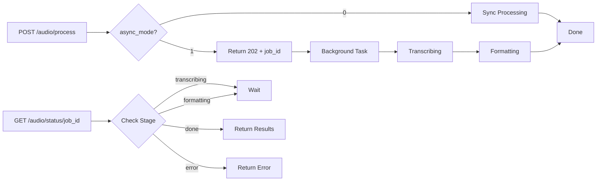

Asta's audio notes system transcribes voice recordings with faster-whisper and formats them into meeting notes, action items, or conversation summaries using AI.

## Overview

The audio notes pipeline:

1. **Upload** - Audio file (web) or voice message (Telegram)
2. **Transcribe** - faster-whisper converts speech to text
3. **Format** - AI structures transcript per your instruction
4. **Save** - Meeting notes stored for later retrieval

## Supported Formats

- MP3
- M4A
- WAV
- OGG
- WebM
- FLAC
- MP4 (audio track)
- MPEG

<Note>
faster-whisper automatically handles format conversion internally using FFmpeg.
</Note>

## Usage

### Web Interface

<Steps>
  <Step title="Navigate to Audio Notes">
    Settings → Skills → Enable "Audio Notes" (if disabled)
  </Step>
  
  <Step title="Upload file">
    ```javascript
    const formData = new FormData();
    formData.append('file', audioFile);
    formData.append('instruction', 'Format as meeting notes');
    formData.append('whisper_model', 'base');
    formData.append('async_mode', '1');

    const response = await fetch('/audio/process', {
      method: 'POST',
      headers: {
        'Authorization': `Bearer ${token}`
      },
      body: formData
    });

    const { job_id } = await response.json();
    ```
  </Step>
  
  <Step title="Poll for status">
    ```javascript
    const statusResponse = await fetch(`/audio/status/${job_id}`);
    const status = await statusResponse.json();
    // { stage: 'transcribing' | 'formatting' | 'done' | 'error' }
    ```
  </Step>
  
  <Step title="Retrieve results">
    When `stage === 'done'`:
    ```javascript
    {
      "stage": "done",
      "transcript": "Full transcript text...",
      "formatted": "## Meeting Notes\n- Key point 1\n..."
    }
    ```
  </Step>
</Steps>

### Telegram

Send voice messages or audio files directly:

```
[Voice Message: 2:34]
Caption: meeting notes
```

Asta responds with:
```
Transcribing…
Formatting…

📝 Meeting Notes - March 6, 2026

## Discussion Points
- Product launch timeline
- Marketing budget allocation
- Team hiring priorities

## Action Items
[ ] Sarah: Finalize Q2 roadmap by Friday
[ ] Mike: Schedule design review

📝 Transcript:
[Full transcript if under 500 chars]
```

<Note>
Telegram voice messages use Opus codec in OGG container. faster-whisper handles this automatically.
</Note>

## Async Processing Flow

The async API (recommended for files > 1 minute):



### Job Status Polling

Poll every 2-5 seconds:

```javascript
async function waitForAudio(jobId) {
  while (true) {
    const response = await fetch(`/audio/status/${jobId}`);
    const status = await response.json();
    
    if (status.stage === 'done') {
      return {
        transcript: status.transcript,
        formatted: status.formatted
      };
    }
    
    if (status.stage === 'error') {
      throw new Error(status.error);
    }
    
    // Still processing
    await new Promise(resolve => setTimeout(resolve, 2000));
  }
}
```

<Warning>
Jobs expire after 1 hour. Retrieve results promptly or they'll be garbage collected.
</Warning>

## Whisper Models

faster-whisper supports multiple model sizes:

| Model | Size | Speed | Accuracy | Use Case |
|-------|------|-------|----------|----------|
| `tiny` | 39 MB | Fastest | Lower | Quick drafts |
| `base` | 74 MB | Fast | Good | Default |
| `small` | 244 MB | Medium | Better | Most recordings |
| `medium` | 769 MB | Slow | High | Important meetings |
| `large-v2` | 1.5 GB | Slowest | Highest | Critical transcripts |

Specify via `whisper_model` parameter (default: `base`).

<Note>
Models are downloaded on first use and cached. First run with a new model may take extra time.
</Note>

## Formatting Instructions

The `instruction` parameter guides AI formatting:

### Meeting Notes

```
Format as meeting notes with bullet points, action items, and key decisions.
```

Output:
```markdown
## Meeting Notes - Project Kickoff

### Attendees
- Sarah (PM)
- Mike (Engineering)
- Alex (Design)

### Key Points
- Launch target: April 15
- MVP scope: core features only
- Weekly syncs every Monday 10am

### Decisions
- Use React for frontend
- Deploy on AWS
- 2-week sprints

### Action Items
[ ] Sarah: Create project roadmap by EOW
[ ] Mike: Set up CI/CD pipeline
[ ] Alex: Design system audit
```

### Action Items Only

```
Extract action items from this conversation.
```

Output:
```markdown
## Action Items

1. **Sarah** - Finalize Q2 roadmap (due: Friday)
2. **Mike** - Review PR #234 (urgent)
3. **Alex** - Update design specs (by EOD)
```

### Conversation Summary

```
Summarize this conversation in 3-5 sentences.
```

Output:
```
The team discussed the Q2 roadmap and agreed on an April 15 launch date. 
Key technical decisions include using React and deploying on AWS. 
Action items were assigned to finalize the roadmap, set up CI/CD, and 
complete the design system audit.
```

### Voice Memo

```
Clean up this voice memo and make it readable.
```

Output:
```
Idea for the mobile app: Add a quick-capture button on the home screen that 
lets users record voice notes without opening the full interface. This would 
be useful for rapid note-taking during meetings or on the go. Implementation 
could use a floating action button with background recording.
```

## Meeting Notes vs Voice Memos

Asta automatically saves recordings with "meeting" in the instruction:

```python
def _is_meeting_instruction(instruction: str) -> bool:
    t = (instruction or "").strip().lower()
    return "meeting" in t
```

Meeting notes are:
- Stored in database with timestamp
- Retrievable via natural language queries
- Included in context for questions like:
  - "What did we discuss in the last meeting?"
  - "Show me action items from yesterday's standup"
  - "Who was assigned to the frontend task?"

Implementation: `backend/app/audio_notes.py:17-22, 84-92`

## Error Handling

### Skill Disabled

```json
{
  "error": "Audio notes skill is disabled. Enable it in Settings → Skills."
}
```

Enable via web interface or directly in database.

### No Speech Detected

```json
{
  "transcript": "(no speech detected)",
  "formatted": "No speech detected in the audio."
}
```

Causes:
- Silent audio file
- Background noise only
- Corrupt audio
- Unsupported codec

### Provider Unavailable

```json
{
  "transcript": "Full transcript...",
  "formatted": "No AI provider available. Set an API key in Settings."
}
```

Transcription succeeds but formatting fails. Configure a provider with API key.

## Implementation Reference

### Core Logic

`backend/app/audio_notes.py`:

```python
async def process_audio_to_notes(
    data: bytes,
    filename: str | None = None,
    instruction: str = "",
    user_id: str = "default",
    whisper_model: str = "base",
    progress_callback: Callable[[str], Awaitable[None]] | None = None,
) -> dict[str, str]:
    # 1. Check skill enabled
    enabled = await db.get_skill_enabled(user_id, "audio_notes")
    if not enabled:
        raise ValueError("Audio notes skill is disabled...")
    
    # 2. Transcribe
    await progress_callback("transcribing")
    transcript = await transcribe_audio(data, filename, model=whisper_model)
    
    # 3. Format with AI
    await progress_callback("formatting")
    provider = get_provider(provider_name)
    chat_resp = await provider.chat(messages, model=user_model)
    
    # 4. Save if meeting
    if _is_meeting_instruction(instruction):
        await db.save_audio_note(user_id, title, transcript, formatted)
    
    return {"transcript": transcript, "formatted": formatted}
```

### API Endpoints

`backend/app/routers/audio.py`:

- **Lines 27-68**: POST `/audio/process` - Upload and process
- **Lines 71-85**: GET `/audio/status/{job_id}` - Poll status
- **Lines 15-17**: In-memory job store with 1-hour expiry

### Telegram Integration

`backend/app/channels/telegram_bot.py`:

- **Lines 466-539**: `on_voice_or_audio()` - Voice message handler
- **Lines 369-405**: Audio from URL (workaround for 20 MB limit)
- **Lines 511-514**: Progress callback for Telegram status updates

## Advanced Usage

### Custom Formatting Prompts

```python
instruction = """
Format this as a technical spec with:
1. Requirements (numbered list)
2. Architecture decisions (bullet points)
3. Open questions (checkbox list)

Use emoji for section headers.
"""
```

### Batch Processing

Process multiple files:

```python
import asyncio

job_ids = []
for audio_file in audio_files:
    response = await upload_audio(audio_file, async_mode=1)
    job_ids.append(response['job_id'])

# Wait for all
results = await asyncio.gather(*[
    wait_for_audio(job_id) for job_id in job_ids
])
```

### Integration with Calendar

Meeting notes can reference calendar events:

```
Transcribe this recording from my 2pm meeting with the eng team.
```

Asta checks your calendar and adds context:
```
## Meeting: Engineering Sync
**Time**: 2:00 PM - 3:00 PM
**Attendees**: Sarah, Mike, Alex

[Formatted notes...]
```

## Performance

### Transcription Speed

On typical hardware (CPU):

- **tiny**: ~10x realtime (1 min audio = 6s processing)
- **base**: ~5x realtime (1 min audio = 12s processing)
- **small**: ~2x realtime (1 min audio = 30s processing)
- **medium**: ~1x realtime (1 min audio = 60s processing)

GPU acceleration (CUDA) provides 2-5x speedup.

### Formatting Speed

- **Fast providers** (Groq, Ollama local): 1-3 seconds
- **Standard providers** (OpenAI, Claude): 3-8 seconds
- **Complex formats**: +2-5 seconds

### Total Pipeline Time

For 5-minute recording:

1. **Upload**: ~2s (depends on connection)
2. **Transcription**: ~1 min (base model, CPU)
3. **Formatting**: ~5s (Claude)
4. **Total**: ~70 seconds

<Note>
Async mode is essential for recordings over 2 minutes to avoid request timeouts.
</Note>

## Troubleshooting

### Transcription Accuracy Issues

1. **Use larger model** - `small` or `medium` for better accuracy
2. **Check audio quality** - Ensure clear recording, minimal background noise
3. **Specify language** - Add language hint in instruction (future feature)

### Formatting Not As Expected

1. **Be specific** - Detailed instructions produce better results
2. **Try different provider** - Claude excels at structured formatting
3. **Include examples** - Show desired format in instruction

### Telegram Audio Failing

1. **Check file size** - Telegram limit is 20 MB for downloads
2. **Use URL workaround** - Upload to cloud storage, paste direct link
3. **Verify bot permissions** - Bot needs message access

### Job Not Found

```json
{"error": "Job not found or expired."}
```

Causes:
- Job completed over 1 hour ago (expired)
- Invalid job_id
- Server restarted (in-memory store cleared)

Solution: Re-upload and poll immediately.