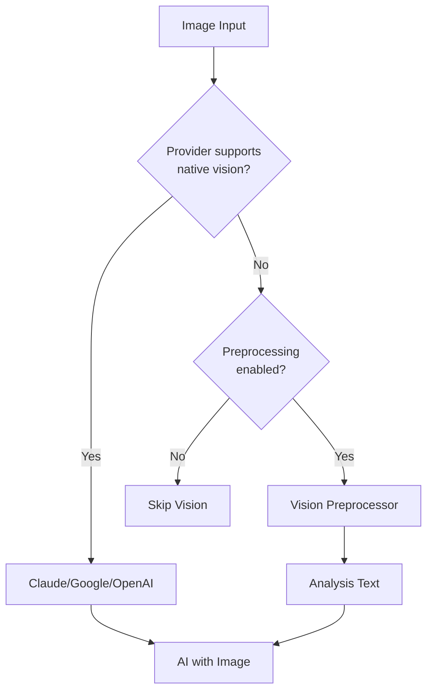

Asta's vision system uses a hybrid approach: native vision for supported providers (Claude, Google, OpenAI) and a preprocessing pipeline for other models.

## Architecture

The vision pipeline automatically selects the best processing method:



## Native Vision Providers

These providers support vision directly without preprocessing:

### Claude (Anthropic)

- **Models**: All Claude 3+ models (Haiku, Sonnet, Opus)
- **Format**: Base64-encoded images in message content
- **Max size**: 5 MB per image
- **Supported formats**: JPEG, PNG, GIF, WebP

```python
# Automatic vision handling in handler.py:3177-3179
if provider_name in _NATIVE_VISION_PROVIDERS:
    logger.info("Provider %s supports native vision; passing image directly", provider_name)
    # Image passed directly to provider.chat()
```

### Google Gemini

- **Models**: Gemini 1.5+ (Pro, Flash)
- **Format**: Data URLs with base64 content
- **Features**: Multi-image support, video frames
- **Implementation**: `backend/app/providers/google.py:50-58`

### OpenAI

- **Models**: GPT-4 Vision, GPT-4o, GPT-5.2+
- **Format**: Data URLs in message array
- **Features**: High/low detail modes, multiple images
- **Implementation**: `backend/app/providers/openai.py:51-55`

<Note>
Native vision providers receive images as part of the chat request and analyze them directly with their multimodal models.
</Note>

## Vision Preprocessor

For providers without native vision (Ollama, Groq, etc.), Asta uses a preprocessing pipeline:

### How It Works

<Steps>
  <Step title="Image received">
    User sends text + image via web chat or Telegram
  </Step>
  
  <Step title="Preprocessor activated">
    If provider doesn't support vision, `_run_vision_preprocessor()` is called
  </Step>
  
  <Step title="Vision model analyzes">
    OpenRouter's free vision models analyze the image:
    - Scene description
    - OCR (text extraction)
    - Object identification
    - Layout analysis
  </Step>
  
  <Step title="Analysis injected">
    Vision analysis is prepended to the conversation:
    ```
    [Image analysis by openrouter/nvidia-nemotron]
    Scene: Office workspace with MacBook Pro...
    Text visible: "Q2 Roadmap" on whiteboard
    Objects: Laptop, coffee mug, notebook
    ```
  </Step>
  
  <Step title="Non-vision model responds">
    Your chosen provider (e.g., Ollama) sees the analysis text and responds
  </Step>
</Steps>

### Configuration

Configure preprocessing in Settings → Vision or via environment:

```bash
# Enable/disable preprocessing (default: enabled)
ASTA_VISION_PREPROCESS=true

# Provider order (tries each until success)
ASTA_VISION_PROVIDER_ORDER=openrouter,ollama

# OpenRouter model for preprocessing
ASTA_VISION_OPENROUTER_MODEL=nvidia/nemotron-nano-12b-v2-vl:free
```

<Warning>
Disabling preprocessing with `ASTA_VISION_PREPROCESS=false` will cause vision requests to fail for non-vision providers.
</Warning>

### Fallback Chain

The preprocessor tries providers in order:

1. **OpenRouter** - Free vision models (default)
2. **Ollama** - Local vision-capable models (if configured)

If all fail, the image is skipped and only text is processed.

### Supported Models

OpenRouter free vision models:
- `nvidia/nemotron-nano-12b-v2-vl:free` (default)
- `openrouter/free` (auto-routes to best available)

Ollama vision models:
- `llava` (7B/13B/34B)
- `bakllava`
- `moondream`

Implementation: `backend/app/handler.py:892-984`

## Image Attachment Methods

### Web Chat API

```javascript
const file = document.getElementById('image').files[0];
const reader = new FileReader();

reader.onload = async (e) => {
  const base64 = e.target.result.split(',')[1];
  
  const response = await fetch('/chat', {
    method: 'POST',
    headers: {
      'Content-Type': 'application/json',
      'Authorization': `Bearer ${token}`
    },
    body: JSON.stringify({
      text: 'What is this?',
      provider: 'claude',
      image_base64: base64,
      image_mime: 'image/jpeg'
    })
  });
};

reader.readAsDataURL(file);
```

### Inline Markdown Images

Embed images directly in message text:

```markdown
Analyze this diagram:


What are the key components?
```

Asta extracts the image and processes it separately.

### Telegram

Send photos directly in Telegram:
1. Attach photo to message
2. Add caption with your question
3. Asta receives image bytes and MIME type automatically

<Note>
Telegram compresses photos. For high-quality analysis, send as "File" instead of "Photo".
</Note>

## PDF Vision Fallback

When PDFs have poor text extraction quality, Asta renders pages as images:

### Quality Assessment

PDFs are evaluated on:
- Characters per page (< 100 = poor)
- Alphabetic ratio (< 35% = poor)
- Average word length (2-25 chars)
- Sentence density (< 10% = blueprint/diagram)

Implementation: `backend/app/handler.py:133-167`

### Vision Fallback Process

<Steps>
  <Step title="Render pages">
    Convert up to 4 pages to JPEG (150 DPI, max 1600px)
  </Step>
  
  <Step title="Choose analyzer">
    - **Native vision provider** (if Claude/Google/OpenAI active) → Direct analysis
    - **Otherwise** → Vision preprocessor
  </Step>
  
  <Step title="Extract per page">
    Each page analyzed separately:
    ```
    [Page 1/3]
    Text: "Q2 Financial Report"
    Table: Revenue breakdown by region
    Diagram: Sales funnel visualization
    ```
  </Step>
  
  <Step title="Combine results">
    All analyses concatenated (max 8000 chars) and used as document content
  </Step>
</Steps>

Implementation:
- Native provider: `backend/app/handler.py:256-323`
- Preprocessor fallback: `backend/app/handler.py:206-253`

### Example Use Cases

- **Scanned documents** - OCR with vision instead of native text extraction
- **Architectural blueprints** - Extract labels and measurements
- **Infographics** - Describe visual elements and extract data
- **Foreign language documents** - OCR + translation

## Advanced Configuration

### API Settings

```bash
GET /settings/vision
{
  "preprocess": true,
  "provider_order": "openrouter,ollama",
  "openrouter_model": "nvidia/nemotron-nano-12b-v2-vl:free"
}

PUT /settings/vision
{
  "preprocess": true,
  "provider_order": "ollama",
  "openrouter_model": "openrouter/free"
}
```

Implementation: `backend/app/routers/settings.py:257-272`

### Vision Context Prompt

The preprocessor uses this system prompt:

```
You are Asta's vision preprocessor. Analyze the image and return concise factual notes.
Output plain text only (no code fences). Include:
- scene summary
- visible text (OCR)
- important objects/entities
- uncertainty notes if relevant
```

This ensures consistent, parseable output across all vision models.

## Performance Considerations

### Image Size Limits

- **Web upload**: 10 MB (configurable)
- **Telegram**: 20 MB (photo), 20 MB (file)
- **Base64 inline**: Practical limit ~5 MB (context length)

### Optimization

Images are automatically:
1. **Resized** - Max 1600px dimension (PDF pages)
2. **Compressed** - JPEG quality 75% for PDF renders
3. **Format converted** - PNGs converted to RGB for JPEG encoding

Implementation: `backend/app/handler.py:170-203`

### Timeouts

- **Vision preprocessor**: 50s per attempt
- **Native vision**: 45s per request
- **PDF page render**: No timeout (fast, local)

Failed attempts automatically fall back to next provider in chain.

## Troubleshooting

### Vision Not Working

1. **Check provider** - Verify native support or preprocessor enabled
2. **Test preprocessor** - Try OpenRouter with free model
3. **Validate image** - Ensure JPEG/PNG, not corrupted
4. **Check logs** - Look for "Vision preprocess complete" or error messages

### Poor Quality Results

1. **Use native vision** - Claude/Google/OpenAI have better accuracy
2. **Increase resolution** - Send high-quality images
3. **Add context** - Include specific questions in text prompt
4. **Try different model** - Some preprocessor models excel at OCR vs. scene understanding

### PDF Vision Failing

1. **Check page count** - Only first 4 pages rendered
2. **Verify provider** - Native vision providers produce better results
3. **Manual extraction** - For critical documents, extract text manually and paste

<Note>
Vision processing increases response time by 5-15 seconds depending on provider and image complexity.
</Note>